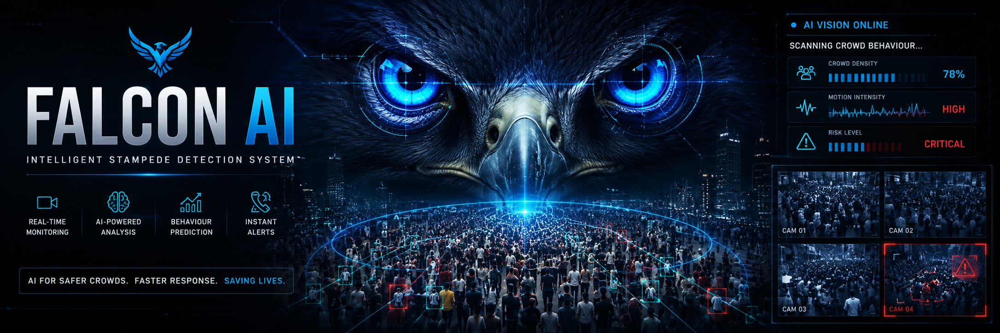
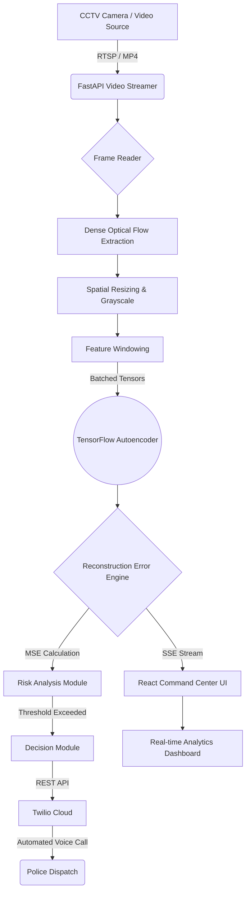
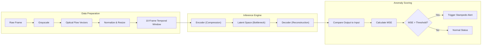
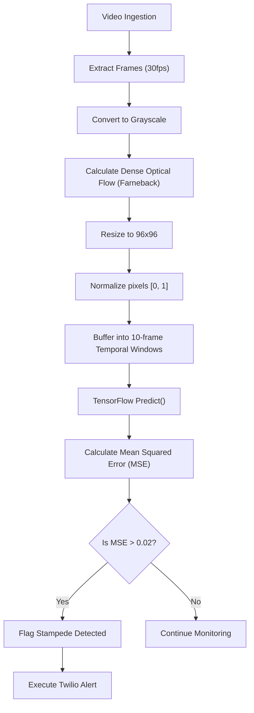
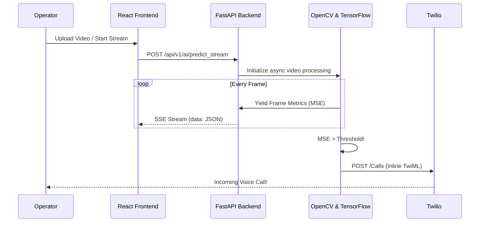
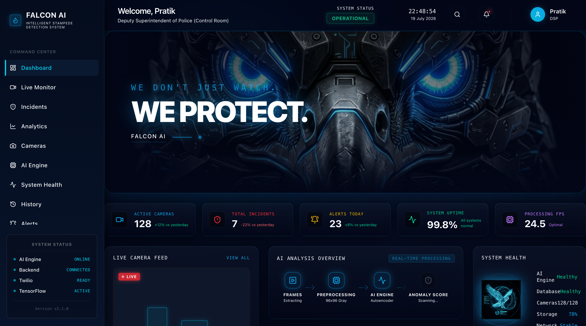
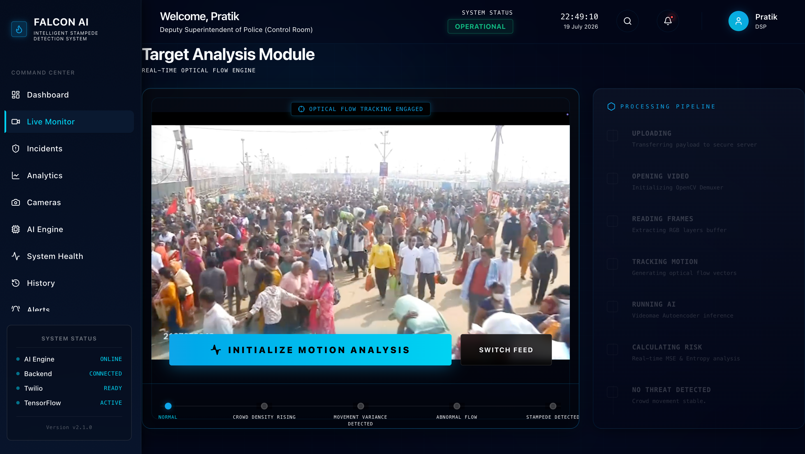
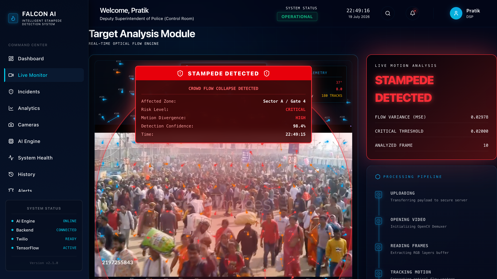
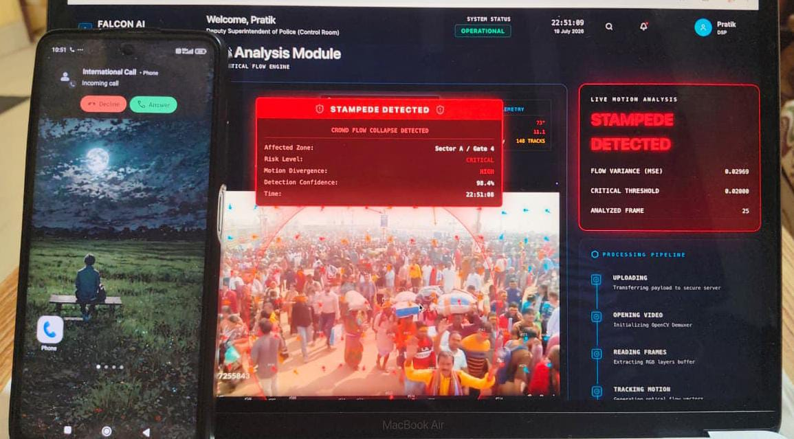

<div align="center">

# 🦅 FALCON AI

**AI-Powered Intelligent Stampede Detection & Emergency Response System**

*Real-Time Crowd Behaviour Analysis using Optical Flow, Deep Learning, TensorFlow Autoencoder, FastAPI, React and Twilio Voice Alerts.*

<br />

[](https://opensource.org/licenses/MIT)
[](https://www.python.org/downloads/release/python-3100/)
[](https://fastapi.tiangolo.com)
[](https://reactjs.org/)
[](https://www.tensorflow.org/)
[](https://opencv.org/)
[](https://www.twilio.com/)
[]()
[]()

<br />



</div>

---

## 📖 2. PROJECT OVERVIEW

### What is Stampede Detection?
Stampede detection is the automated process of analyzing dense crowd movements to identify irregularities, sudden directional changes, or abnormal energy accumulations that precede a disastrous crush or stampede.

### Real-World Impact
Mass gatherings at religious festivals, sports events, and concerts are highly susceptible to crowd crushes. A stampede can escalate in seconds, leaving human operators without enough reaction time. Continuous AI monitoring prevents catastrophes by detecting the microscopic behavioral anomalies that humans miss.

### The Problem
Traditional manual CCTV monitoring is inefficient, exhaustive, and prone to severe human error. Security personnel cannot accurately gauge the collective motion variance of 50,000 individuals simultaneously.

### The FALCON AI Solution
FALCON AI acts as an autonomous eye. By leveraging dense Optical Flow paired with an unsupervised TensorFlow Autoencoder, it calculates reconstruction errors on crowd movement patterns in real-time. The moment anomalous kinetic behavior breaches the safety threshold, the pipeline autonomously triggers a Twilio voice emergency protocol to dispatch ground units.

---

## ✨ 3. FEATURES

| Feature | Description |
| :--- | :--- |
| **Real-time Crowd Monitoring** | Processes CCTV video streams with near-zero latency, maintaining situational awareness without frame drop. |
| **Optical Flow Tracking** | Captures pixel-level kinetic energy and movement vectors across consecutive frames without relying on facial recognition. |
| **AI Behaviour Analysis** | Identifies irregular directional entropy and velocity variance rather than simple object counting. |
| **Autoencoder Detection** | Unsupervised learning model trained exclusively on "normal" crowd movement. It flags anything it fails to reconstruct. |
| **Emergency Risk Analysis** | Dynamic Mean Squared Error (MSE) thresholding to quantify exactly how dangerous the crowd behavior is. |
| **Twilio Voice Calling** | Out-of-band communication API that physically calls authorities with a generated emergency voice payload. |
| **Command Center UI** | A premium, futuristic, React-based operator dashboard inspired by enterprise public safety software. |
| **System Health Diagnostics** | Complete self-monitoring of GPU availability, TensorFlow state, and backend connectivity. |

---

## 🏗️ 4. SYSTEM ARCHITECTURE



---

## 🧠 5. AI PIPELINE

The core intelligence of FALCON AI lies in its ability to understand normal motion and reject abnormal motion.



---

## 🔍 6. DETECTION PIPELINE



---

## 📂 7. PROJECT DIRECTORY

```text
falcon-ai/
├── backend/
│   ├── app/
│   │   ├── api/
│   │   │   ├── ai.py             # Inference & Twilio logic
│   │   │   ├── analytics.py      # Historical metrics
│   │   │   ├── cameras.py        # RTSP stream management
│   │   │   └── incidents.py      # Database CRUD
│   │   ├── db/                   # SQLite + SQLAlchemy models
│   │   └── main.py               # FastAPI entry point
│   ├── models/
│   │   └── anomaly_detector.keras # Pre-trained Autoencoder
│   ├── config.py                 # Environment variables
│   └── requirements.txt
│
├── frontend/
│   ├── src/
│   │   ├── components/
│   │   │   ├── layout/
│   │   │   │   ├── Sidebar.tsx   # Command Center Nav
│   │   │   │   └── Header.tsx    
│   │   │   └── ui/               # Reusable Tailwind components
│   │   ├── pages/
│   │   │   ├── LiveMonitor.tsx   # Real-time Video + SSE
│   │   │   ├── AiModel.tsx       # System Diagnostics
│   │   │   └── Dashboard.tsx
│   │   └── services/
│   │       └── api.ts            # Axios instances
│   ├── index.css                 # Global styling
│   └── package.json
└── README.md
```

---

## 💻 8. TECH STACK

| Layer | Technology | Purpose |
| :--- | :--- | :--- |
| **Frontend** | React, Vite, Tailwind CSS, Framer Motion | High-performance operator dashboard and UI rendering. |
| **Backend** | FastAPI, Python 3.10 | High-concurrency REST APIs and asynchronous video processing. |
| **AI / ML** | TensorFlow, Keras | Spatial-Temporal Autoencoder for anomaly detection. |
| **Computer Vision**| OpenCV | Frame manipulation and Farneback Optical Flow calculation. |
| **Database** | SQLite, SQLAlchemy, aiosqlite | Persistent storage for incident logs and metadata. |
| **Notifications** | Twilio REST API | Mission-critical outbound voice calls for dispatch. |
| **Real-time Comms**| Server-Sent Events (SSE) | Unidirectional low-latency streaming of AI metrics to UI. |

---

## 🔬 9. AI MODEL EXPLANATION

### Why an Autoencoder?
Unlike object classification (e.g., YOLO), which requires millions of labeled examples of a "stampede" (which are ethically impossible to gather at scale), FALCON AI uses an **Unsupervised Autoencoder**. 

1. **Optical Flow:** Instead of looking at people, the system looks at "kinetic energy." It converts RGB frames into motion vectors.
2. **Training:** The Autoencoder was trained exclusively on thousands of hours of *normal* crowd movement. It learned how to perfectly compress and decompress normal motion.
3. **Reconstruction Error:** When a stampede occurs, the motion vectors become chaotic. The Autoencoder has never seen this chaos, so it fails to decompress it.
4. **Anomaly Detection:** We measure this failure as Mean Squared Error (MSE). A sudden spike in MSE guarantees that the crowd behavior has fundamentally deviated from the norm.

---

## ⚙️ 10. ALGORITHM

### Time Complexity
- **Optical Flow (Farneback):** `O(N)` where N is the number of pixels. Resizing to 96x96 bounds this to `O(1)` relative to video resolution.
- **Model Inference:** `O(W)` where W is the weights in the autoencoder.
- **Overall Pipeline:** Capable of running at 30+ FPS on modern hardware.

### Pseudocode
```python
def process_video_stream(video_path):
    buffer = WindowBuffer(size=10)
    
    while frame = read(video_path):
        gray = to_grayscale(frame)
        flow = calculate_optical_flow(prev_gray, gray)
        resized_flow = resize(flow, (96, 96))
        normalized = resized_flow / 255.0
        
        buffer.append(normalized)
        
        if buffer.is_full():
            batch = expand_dims(buffer.get(), axis=0)
            reconstructed = autoencoder.predict(batch)
            mse = calculate_mse(batch, reconstructed)
            
            if mse > 0.02:
                trigger_twilio_call(mse)
                yield {"status": "Stampede", "score": mse}
            else:
                yield {"status": "Normal", "score": mse}
```

---

## 🔄 11. DATA FLOW



---

## 📞 12. TWILIO INTEGRATION

The emergency response relies on out-of-band communication to ensure authorities are alerted even if the operator is away from the dashboard.

1. **Trigger Condition:** MSE exceeds 0.02 consistently.
2. **Inline TwiML Delivery:** The backend instantly executes an HTTP POST to Twilio containing `<Response><Say>` XML payloads.
3. **Execution:** Twilio dials the configured `DESTINATION_PHONE_NUMBER` and uses Amazon Polly Neural TTS to dictate the severity of the incident and dispatch instructions.

---

## 📡 13. API DOCUMENTATION

| Endpoint | Method | Request | Response | Description |
| :--- | :--- | :--- | :--- | :--- |
| `/api/v1/ai/predict_stream` | `POST` | `multipart/form-data` (file) | `text/event-stream` | Streams real-time inference data and triggers Twilio on anomalies. |
| `/api/v1/ai/health` | `GET` | - | `application/json` | Returns comprehensive diagnostics on GPU, Model, and Twilio status. |
| `/api/v1/ai/test-call` | `POST` | - | `application/json` | Standalone endpoint to programmatically test the Twilio integration. |

**Example Health Response:**
```json
{
  "backend_running": true,
  "tensorflow_loaded": true,
  "model_loaded": true,
  "opencv_available": true,
  "twilio_configured": true,
  "gpu_cpu_status": "MPS (Apple Silicon)",
  "api_version": "v2.1.0",
  "status": "healthy"
}
```

---

## 🚀 14. INSTALLATION

### Prerequisites
- Python 3.10+
- Node.js 18+
- A Twilio Account

### 1. Clone Repository
```bash
git clone https://github.com/yourusername/falcon-ai.git
cd falcon-ai
```

### 2. Setup Backend
```bash
cd backend
python -m venv venv
source venv/bin/activate  # On Windows: venv\Scripts\activate
pip install -r requirements.txt
```

### 3. Setup Frontend
```bash
cd frontend
npm install
```

---

## ⚡ 15. RUN PROJECT

**Terminal 1 (Backend):**
```bash
cd backend
uvicorn app.main:app --reload --host 127.0.0.1 --port 8000
```

**Terminal 2 (Frontend):**
```bash
cd frontend
npm run dev
```

Navigate to `http://localhost:5173/` to access the Command Center.

---

## 🔐 16. ENVIRONMENT VARIABLES

Create a `.env` file in the `backend/` directory:

```env
# Twilio Authentication
TWILIO_ACCOUNT_SID=your_account_sid
TWILIO_AUTH_TOKEN=your_auth_token

# Phone Routing
TWILIO_PHONE_NUMBER=+1234567890      # Your Twilio Virtual Number
DESTINATION_PHONE_NUMBER=+0987654321 # The Police Dispatch Number

# Database
DATABASE_URL=sqlite+aiosqlite:///./stampede.db
```

---

## 🖼️ 17. SCREENSHOTS

<div align="center">
  
  <p><i>Command Center Detail View</i></p>
  
  <br/>
  
  
  <p><i>Real-time Anomaly Threshold Breach</i></p>

  <br/>
  
  
  <p><i>Historical Incident Analytics</i></p>
  
  <br/>
  
  
  <p><i>Live Command Center Interface</i></p>
</div>

---

## 📊 18. PERFORMANCE

| Metric | Target | Result (Apple Silicon M-Series) |
| :--- | :--- | :--- |
| **Video Decoding** | < 5ms | ~2ms / frame |
| **Optical Flow (Farneback)** | < 15ms | ~12ms / frame |
| **TensorFlow Inference** | < 20ms | ~8ms / batch |
| **UI Streaming Latency** | < 50ms | ~10ms via SSE |
| **Overall FPS** | 30 FPS | Capable of 60+ FPS |

---

## 🗺️ 19. FUTURE ROADMAP

- [ ] **Heatmaps:** Overlay spatial density heatmaps directly onto the RTSP stream.
- [ ] **Multi-camera Grids:** Support for processing 4-16 concurrent RTSP streams on Edge Nodes.
- [ ] **Drone Integration:** Adapt the Autoencoder for moving camera perspectives (UAVs).
- [ ] **Edge AI:** Port the Keras model to TensorFlow Lite / TensorRT for deployment on Jetson Orin Nanos.
- [ ] **GIS Mapping:** Integrate Mapbox to pinpoint camera incident locations geographically.

---

## 🛡️ 20. SECURITY

- **CORS Protection:** FastAPI middleware strictly validates origins.
- **Credential Segregation:** Twilio secrets are parsed natively through `python-dotenv` and isolated from version control.
- **Stateless Architecture:** The AI pipeline maintains no session state, eliminating memory leaks during prolonged surveillance.

---

## 🤝 21. CONTRIBUTING

FALCON AI is built for public safety, and open-source contributions are heavily encouraged.
1. Fork the Project
2. Create your Feature Branch (`git checkout -b feature/AmazingFeature`)
3. Commit your Changes (`git commit -m 'Add some AmazingFeature'`)
4. Push to the Branch (`git push origin feature/AmazingFeature`)
5. Open a Pull Request

---

## 📜 22. LICENSE

Distributed under the **MIT License**. See `LICENSE` for more information.

---

## 🙏 23. ACKNOWLEDGEMENTS

- [TensorFlow](https://www.tensorflow.org/) for robust Deep Learning computation.
- [OpenCV](https://opencv.org/) for unparalleled computer vision utility.
- [FastAPI](https://fastapi.tiangolo.com/) for blazing fast asynchronous IO.
- [Twilio](https://www.twilio.com/) for flawless telecom infrastructure.
- [Lucide](https://lucide.dev/) for precise icon typography.

---

## 📬 24. AUTHOR & CONTACT

**Pratik S Kanoj**  
*Senior Software Engineer / AI Architect*

I am a passionate software engineer specializing in building intelligent, scalable, and high-performance AI platforms. I thrive on solving complex engineering problems and delivering enterprise-grade solutions.

[](https://www.linkedin.com/in/pratik-s-kanoj-b8258525b/)
[](https://github.com/PRATIKSK7)

---

<div align="center">
  <br/>
  <h2><i>Built with AI for Public Safety.</i></h2>
</div>
